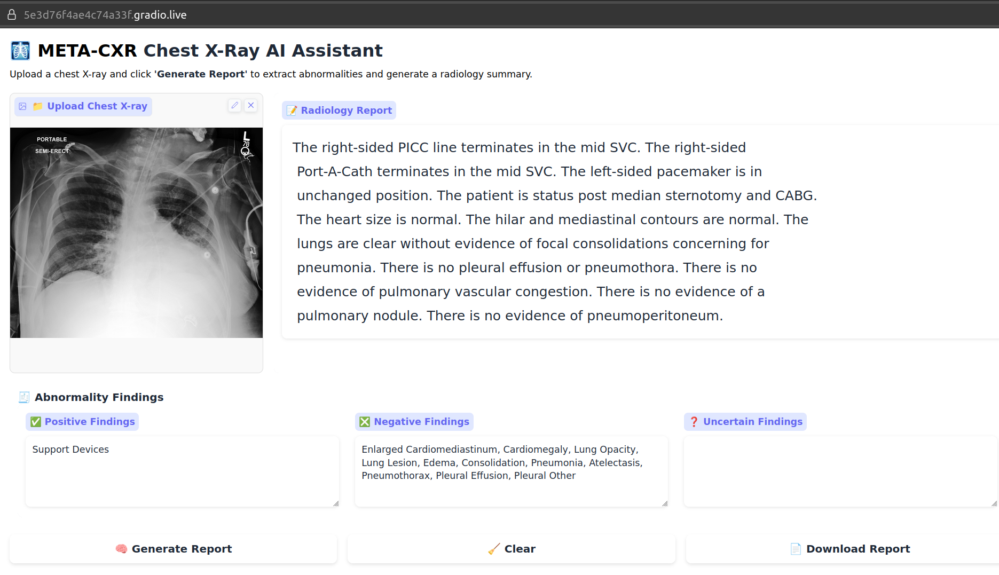

# META-CXR: Multimodal Expert Tokens-Based Vision-Language Model for Abnormality-guided Chest X-Ray Reporting

META-CXR is an advanced vision-language framework that bridges the gap between automated chest X-ray (CXR) interpretation and clinical application. Designed to provide accurate abnormality classification and generate coherent radiology reports, META-CXR incorporates multimodal learning, expert token representations, and cutting-edge vision encoders and large languge models(LLM) to enhance diagnostic precision and explainability.

---

**Authors:** [Dasith Edirisinghe][de], [Wimukthi Nimalsiri][wn], [Mahela Hennayake][mh], [Prof. Dulani Meedeniya][dm], [Dr. Gilbert Lim][gl]

[de]:https://dasithedirisinghe.github.io/
[wn]:https://wimukti.github.io/#/home
[mh]:https://lk.linkedin.com/in/mahela97
[dm]:https://orcid.org/0000-0002-4520-3819
[gl]:https://orcid.org/0000-0002-5381-9250


**✨ News ✨**

Sep 2025 - **Published in IEEE Access**: [DOI: https://doi.org/10.1109/ACCESS.2025.3606961](https://doi.org/10.1109/ACCESS.2025.3606961)

## Publication

This work has been published in **IEEE Access**:

> D. Edirisinghe, W. Nimalsiri, M. Hennayake, D. Meedeniya and G. Lim, "Chest X-Ray Report Generation Using Abnormality Guided Vision Language Model," in IEEE Access, vol. 13, pp. 157651-157673, 2025, doi: https://doi.org/10.1109/ACCESS.2025.3606961

**Citation:**
```bibtex
@article{edirisinghe2025metacxr,
  title={Chest X-Ray Report Generation Using Abnormality Guided Vision Language Model},
  author={Edirisinghe, D. and Nimalsiri, W. and Hennayake, M. and Meedeniya, D. and Lim, G.},
  journal={IEEE Access},
  volume={13},
  pages={157651--157673},
  year={2025},
  publisher={IEEE},
  doi={https://doi.org/10.1109/ACCESS.2025.3606961}
}
```

---


## ✨ Key Features

1. **Multi-Class Abnormality Classification**:
   - META-CXR introduces a classification mechanism that identifies abnormalities as **positive**, **negative**, or **uncertain**, mimicking real-world clinical scenarios.
   - Tailored thresholds for each class improve inference reliability and ensure precise abnormality detection.

2. **Radiology Report Generation**:
   - Utilizes a large language model (LLM) integrated with abnormality findings to generate clinically relevant radiology reports.
   - Reports align with clinical standards, maintaining semantic coherence and diagnostic accuracy.

3. **Expert Token Representations**:
   - Learnable query tokens extract abnormality-specific high-level features, significantly improving classification and report generation tasks.

4. **Multi-Encoder Vision Fusion**:
   - Combines the strengths of ResNet50, Vision Transformer (ViT), and Swin Transformer to capture local and global features.
   - Demonstrates superior performance by leveraging diverse architectural capabilities for feature extraction.

5. **Explainable AI (XAI)**:
   - Includes attention map visualizations that highlight critical regions in the X-rays, offering transparent and interpretable outputs.
   - Enables clinicians to understand the rationale behind model predictions.

6. **Web Interface**:
   - A user-friendly interface allows users to upload chest X-rays for instant classification, report generation, and attention map visualization.
   - Designed for real-time use, making META-CXR accessible to clinicians and researchers alike.

---

## 🌐 Product



---- 

Key functionalities include:

- **X-Ray Upload**: Easily upload chest X-rays via drag-and-drop or file selection.
- **Classification Results**: View detailed multi-class predictions for abnormalities as positive, negative, or uncertain.
- **Radiology Report Generation**: Obtain automated, clinically relevant reports tailored to the uploaded image.
- **Attention Map Visualization**: Explore attention overlays to understand which regions influenced the model's predictions.

### 📦 META-CXR: Docker Setup and Inference Guide

This project provides a Dockerized environment for running inference on radiographs using a Gradio-based web UI.

---

#### 📖 Overview

META-CXR enables streamlined deployment of a radiograph analysis pipeline using Docker. 

##### 🔧 Clone the META-CXR repo

- Clone the repository and change into the project directory:

```bash
git clone https://github.com/DasithEdirisinghe/META-CXR.git
cd META-CXR
```

#### 🔧 Prerequisites

- Docker installed and configured.
- GPU support for Docker (`--gpus all` is used).
- Pretrained weights required for inference:

➡️ Download these pretrained weights from [This Google Drive link](https://drive.google.com/drive/folders/1zUT1ogIdmEjOXtBe1Vzw44uFV_ZvlcMF?usp=sharing) and place them in the following directory before running inference: 

```
pretrainings/output/
```

Expected structure:

```
pretrainings/output/
├── YYYYYY
   └── XXXXX.pth
```

---

#### ⚙️ Building the Docker image

The `build_docker.sh` script performs the following:

- Pulls the base Docker image `dasithdev/meta-cxr:1.0.0` from Docker Hub (if not present locally).
- Builds a new Docker image `meta-cxr:2.0.0` using the provided Dockerfile.

To build the Docker image, run:

```bash
./build_docker.sh
```

This ensures your environment is consistent and ready for inference.

---

#### 🚀 Running the container

The `run_container.sh` script performs these steps:

- Stops and removes any existing container named `meta-cxr-container`.
- Launches a new container named `meta-cxr-container` using the `meta-cxr:2.0.0` image.
- Maps your current working directory to `/workspace/META-CXR` inside the container.
- Starts the Gradio-based inference UI.

Run:

You must run following commands from inside the META-CXR directory because this directory will be mounted into the container at runtime

```bash
./run_container.sh
```

---

#### 🌐 Accessing the inference UI

After running the container, the script logs a link to the Gradio UI, typically available at:

```
http://localhost:7860
```

-----  


## 🧪 Results

### Abnoramlity Classification Metrics

#### MIMIC-CXR Dataset

Mean Precision, Recall, F1-Score across all 13 pathologies and No Finding 

| Abnormality                | Precision | Recall | F1-Score |
|---------------------|-----------|--------|----------|
| Average             | 0.87      | 0.78   | 0.73     | 

#### CheXpert Dataset

Zero-shot abnormality classification across five pathologies: Atelectasis, Cardiomegaly, Consolidation, Edema, and Pleural Effusion. <br>
Comparison is done with SOTA classifier ChexZero 

| Model                | AUC | F1-Score |
|---------------------|-----------|--------|
| ChexZero             | 0.889  | 0.606   |
| META-CXR (Ours)             | 0.824  | 0.699   |

### Report Generation Metrics

#### MIMIC-CXR Dataset

| Metric    | META-CXR | 
|-----------|-------------|
| BERTScore | 0.426       | 
| CIDEr     | 0.291       | 
| BLEU-4    | 0.102       | 
| ROUGE-L   | 0.280       | 
| METEOR    | 0.173       |

---

## 👨‍⚕️ Clinical Impact

META-CXR enhances radiologist workflows by:
- Automating abnormality detection with high precision and recall.
- Generating clinically accurate and coherent radiology reports.
- Providing interpretable insights through attention map visualizations.

---

## 📖 Acknowledgments

META-CXR leverages the MIMIC-CXR dataset and builds upon advancements in vision-language modeling to provide a state-of-the-art solution for chest X-ray analysis.

© 2025 META-CXR Team